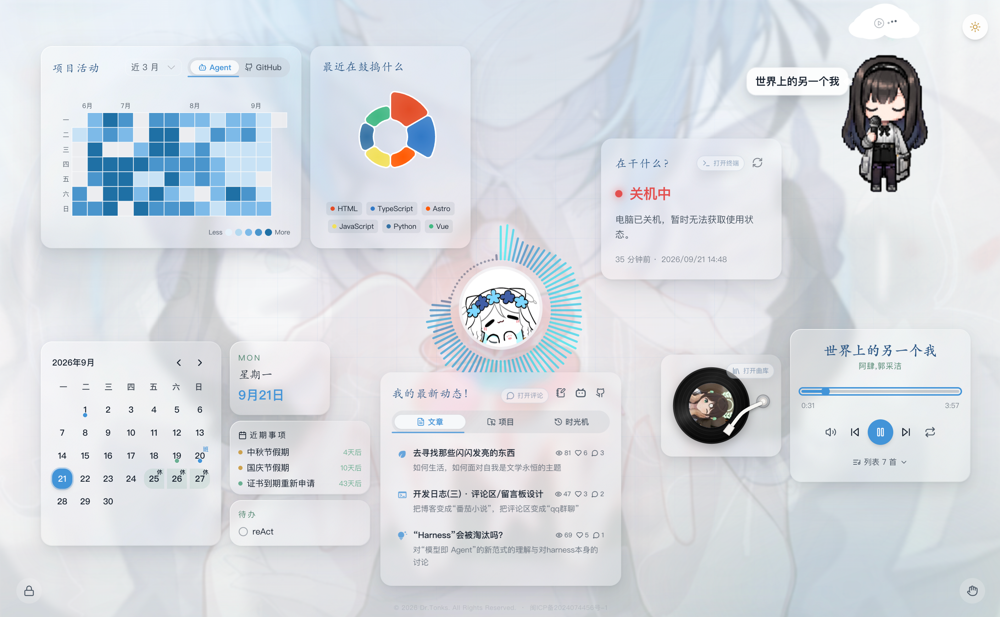
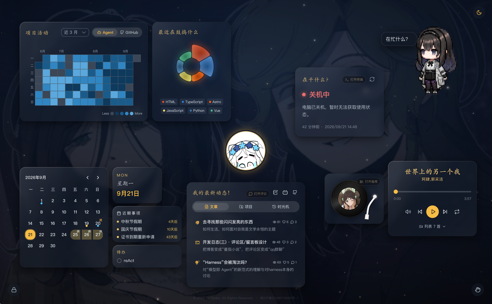
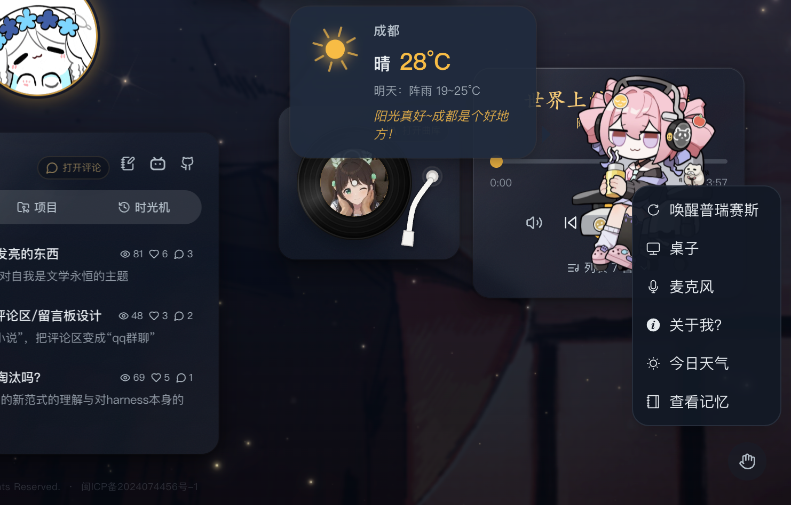
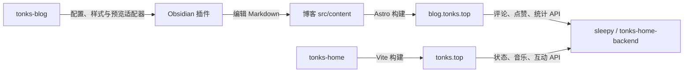

# Tonks Home

一个可以展开、聆听和互动的个人主页。以中心头像为入口，把日历、设备状态、博客、音乐与桌宠放进同一个空间；桌面端展开环绕卡片，移动端使用纵向布局。

[访问主页](https://tonks.top/) · [交互实现笔记](docs/INTERACTIONS.md) · [项目地图](#项目地图) · [本地开发](#本地开发)

## 界面预览



<details>
<summary>查看暗色主题与桌宠交互</summary>

暗色主题下的展开布局：



桌宠右键菜单与交互入口：



</details>

## 值得探索的交互

- **从头像展开主页**：聚合 Agent 活动与 GitHub 贡献、技术栈、设备和日历，保留清晰的个人介绍入口。
- **让音乐参与界面**：黑胶唱片、环形频谱、歌词气泡与桌宠唱歌状态联动。
- **两套桌宠**：普瑞赛斯的表情与情绪状态机、U 酱的 Live2D 表情和道具，通过右键菜单切换。
- **有记忆的日常互动**：问答、记忆笔记与生日问候；本地记忆支持查看、编辑和删除。
- **亮暗主题与动态背景**：光环、星空和卡片布局共同构成两种视觉氛围；手势模块按需加载。

具体状态机、动画与素材来源见 [交互实现笔记](docs/INTERACTIONS.md)。

## 项目地图

这四个项目共同组成 Tonks 的个人站点与写作工具，各自保留独立仓库、依赖与发布流程。按需要克隆即可，无需额外的总仓库。

| 项目 | 职责 | 使用入口 |
| --- | --- | --- |
| [tonks-home](https://github.com/DrTonks/tonks-home) | 个人主页、状态卡片、音乐与桌宠交互 | [tonks.top](https://tonks.top/) |
| [tonks-blog](https://github.com/DrTonks/tonks-blog) | 文章、主题、静态构建与博客预览适配器 | [blog.tonks.top](https://blog.tonks.top/) |
| [tonks-home-backend](https://github.com/DrTonks/tonks-home-backend) | 主页与博客共享的状态、统计、评论等 API | 源码目录常用名 `sleepy` |
| [tonks-obsidianEditor](https://github.com/DrTonks/tonks-obsidianEditor) | Obsidian 格式插入、表单与按需博客预览 | 安装到博客 `src/content/.obsidian/plugins/tonks-blog-tools/` |



博客可单独构建静态页面；动态互动需要后端。Obsidian 插件是可选的本地写作工具，不参与线上服务，也不要求启动 Astro。博客仓库的本地目录沿用 `blogExample`，与 GitHub 上的 `tonks-blog` 是同一个项目。

## 工程结构

| 目录 | 维护内容 |
| --- | --- |
| `src/views/`、`src/routes/` | 页面与路由 |
| `src/components/` | 卡片、桌宠及界面组件 |
| `src/composables/`、`src/stores/` | 可复用交互逻辑与共享状态 |
| `src/api/` | 后端接口与数据契约 |
| `src/config/`、`src/data/` | 配置与内容数据 |
| `src/styles/`、`public/` | 主题样式与公共素材 |
| `scripts/`、`tests/` | 构建检查、发布脚本与测试 |

Vue 3 + TypeScript + Vite；图表使用 ECharts，交互涉及 Three.js、Web Audio、PIXI / Live2D 与 MediaPipe。图表和手势等模块采用延迟或按需加载，具体产物以当前构建为准。

## 本地开发

```bash
git clone https://github.com/DrTonks/tonks-home.git
cd tonks-home
pnpm install --frozen-lockfile
pnpm dev
```

默认地址为 `http://localhost:5173`。需要真实动态数据时，先启动 sleepy，并在 `.env.local` 中设置开发代理：

```dotenv
VITE_API_TARGET=http://localhost:9010
VITE_ARTICLE_INDEX_TARGET=http://localhost:4321
```

`VITE_API_TARGET` 默认指向本地 9010 端口；文章索引默认从线上博客读取，联调本地博客时再设置第二项。`/api`、`/images`、`/music` 由 Vite 代理；后端未启动时，相关数据与互动不能完整使用。服务端密钥应保留在后端。

| 命令 | 用途 |
| --- | --- |
| `pnpm dev` | 本地热更新 |
| `pnpm test` | Vitest 回归测试 |
| `pnpm build` | TypeScript 检查与 Vite 构建 |
| `pnpm check:build` | 检查构建产物 |
| `pnpm preview` | 预览静态产物 |
| `pnpm test:deploy` | 发布脚本安全测试 |

## 部署与维护

前端产物位于 `dist/`，API、音乐与图片服务由 sleepy 提供。生产环境需配置对应反向代理；开发代理不会进入静态产物。跨站身份与评论功能还需要匹配域名、Cookie 和后端配置。

`pnpm deploy` 与 `pnpm ship` 会执行发布操作。部署自己的实例前，应检查 `scripts/deploy.js`、站点资料、外部链接和代理目标，并使用自己的配置。

社区功能维护见 [Markdown 渲染](docs/community-markdown-operations.md)、[表情运维](docs/community-emojis-operations.md) 与 [置顶及表情](docs/community-pinning-and-emojis.md)。

## 素材致谢

普瑞赛斯素材来自 [claude-code-but-priestess](https://github.com/SVAH-X/claude-code-but-priestess)，U 酱模型来自 [原作者配布页面](https://www.bilibili.com/video/BV1z24y1j7CR/)。复用角色、音乐、图片、字体及模型前，请分别确认原作者的许可条件。
